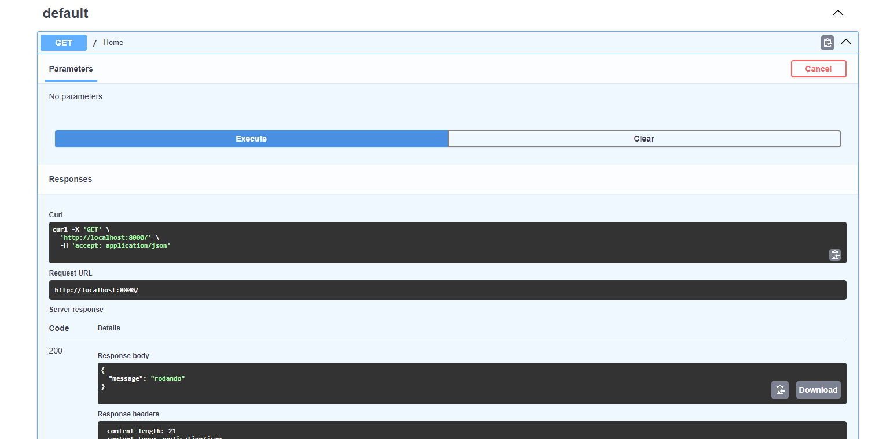

#  API de Gerenciamento de Usuários

API construída com **FastAPI**, **SQLAlchemy** e **Python** para gerenciar usuários, autenticação e upload de arquivos. Projetada para ser simples, funcional e pronta para testes locais.



---

##  Funcionalidades

- Criar, listar, atualizar e deletar usuários
- Upload de arquivos (ex: fotos de perfil)
- Validação de dados com Pydantic
- Testes rápidos com Uvicorn e Swagger UI

---

## Tecnologias Utilizadas

| Tecnologia | Versão |
|------------|--------|
| Python | 3.12+ |
| FastAPI | 0.135.2 |
| SQLAlchemy | 2.0.48 |
| Uvicorn | 0.42.0 |
| Pydantic | 2.12.5 |
| Passlib + bcrypt | autenticação segura |

---

## Pré-requisitos

- Python 3.12 ou superior
- Git (opcional, se for clonar o repositório)
- Windows / Linux / macOS

---

## Como rodar localmente

**1. Clone o repositório**
```bash
git clone https://github.com/seu-usuario/user-management-api.git
cd user-management-api
```

**2. Crie e ative o ambiente virtual**

Windows:
```powershell
python -m venv venv
venv\Scripts\activate
```

Linux/macOS:
```bash
python -m venv venv
source venv/bin/activate
```

**3. Instale as dependências**
```bash
pip install -r requirements.txt
```

**4. Rode a API**
```bash
uvicorn app.main:app --reload
```

**5. Acesse a documentação interativa**

Abra no navegador: [http://localhost:8000/docs](http://localhost:8000/docs)

---

## Estrutura do Projeto

```
user-management-api/
├── app/
│   ├── routers/
│   ├── main.py
│   ├── database.py
│   ├── models.py
│   ├── schemas.py
│   └── crud.py
├── docs/
│   └── swagger-ui.png
├── requirements.txt
└── README.md
```

---

## Endpoints principais

| Método | Rota | Descrição |
|--------|------|-----------|
| POST | `/users/` | Criar novo usuário |
| GET | `/users/` | Listar todos os usuários |
| GET | `/users/{id}` | Buscar usuário por ID |
| PUT | `/users/{id}` | Atualizar usuário |
| DELETE | `/users/{id}` | Deletar usuário |

---

## 🔹 Licença

Este projeto está sob a licença MIT. Sinta-se livre para usar e modificar.
